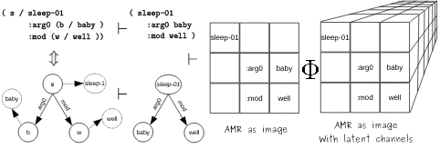
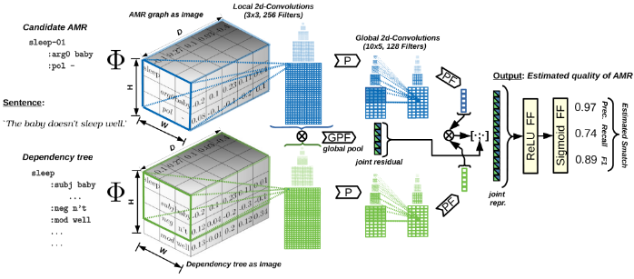

# AMR quality rating with simple CNN encoder

This project contains the simple AMR quality rating method that directly encodes **AMR-penman structure** to simulate a human annotator that inspects AMR graphs and rates their quality. Generally, the encoder should work for any directed rooted graph.


         

## Preparation

The model requires three files: train.json, dev.json, test.json. Each file needs to look minimally like this:

```
{ 
   "some_uri": {
         "amr": "(j / jump-01 :ARG1 (f / frog))",
         "snt": "The green frog jumps",
         "eval": { 
               "Smatch": [    
                           1.0,
                           0.8,
                           0.89
                           ]
                  }
              }  
   "next_uri": ...
```

### Get the data

The full data (*AmrQuality-1*) can be downloaded from here (**new** version 0.0.2 *AmrQuality-2*: bigger data set with additional quality annotations based on AMR3 release): 

```
./download_data.sh
```

Once downloaded:

```
cd data
unzip AmrQuality1-pw-protect.zip
unzip AmrQuality2-pw-protect.zip
``` 

The data are **password protected** since they require LDC license for a sub-part (please contact [us](mailto:opitz@cl.uni-heidelberg.de?subject=[GitHub]%20PW%20amrquality) for further details).

### Dependencies

We recommend to set up an environment, e.g.:

```
conda create -n quamr python=3.6
```

Install spacy

```
pip install -U spacy
```

Download a spacy model

```
python -m spacy download en_core_web_sm
```

* When using the keras code
    *  we used `Keras==2.2.4` with `tensorflow==1.13.1`
* When using the pytorch code
    * we used `pytorch==1.5.0`

Other packages (that you may have already on your platform) that we used are `scikit-learn==0.20.3`, `scipy==1.2.1`, `numpy==1.16.2`

## Run experiments

With keras code

```
./experiment.sh
```

With pytorch code

```
./experiment-pt.sh
```

Please make sure that the file pathes for `train.json`, `dev.json` and `test.json` are correctly set in these two scripts.

## Use a model to predict amr qualities for an amr file 

The input file can be a standard AMR file (AMRs are separated with empty line), like this

```
# ::id someID
# ::snt "the green frog jumps."
(j / jump-01
   :ARG0 (f / frog))
   
# ::id nextSentId
...
...
```

For an example, see

```
./example_predict.sh
```

### Pretrained model and tokenizer

1. Download the [model weights](https://drive.google.com/file/d/1_OiMjLyAap6QbXmW5_xE_IQe9rrtp5AN/view?usp=sharing) and a [tokenizer](https://drive.google.com/file/d/1LYQt9QYOwg9qXZ11mUwaWb8jlY9O6n6s/view?usp=sharing). 

2. Then see/adapt above or `example_predict.sh`. (Notes: Pretrained weights Only available for keras code at the moment, weights trained on v2)

## Notes and (some) future possibilities for improvement/investigations

* use attention mechanism, more layers, different NxM 2Dconvolutions, etc...
* predict other AMR quality aspects (**new** in larger data *AmrQuality-2*: predict wrong/correct triples)
* incorporate word embeddings
    * contextual word embeddings should be easy to incorporate into the sentence/dep tree but not so in the AMR
    * non-contextual embedddings should be usable with AMR and dependency tree

## Citation

```
@inproceedings{opitz-2020-amr,
    title = "{AMR} Quality Rating with a Lightweight {CNN}",
    author = "Opitz, Juri",
    booktitle = "Proceedings of the 1st Conference of the Asia-Pacific Chapter of the Association for Computational Linguistics and the 10th International Joint Conference on Natural Language Processing",
    month = dec,
    year = "2020",
    address = "Suzhou, China",
    publisher = "Association for Computational Linguistics",
    url = "https://www.aclweb.org/anthology/2020.aacl-main.27",
    pages = "235--247",
    abstract = "Structured semantic sentence representations such as Abstract Meaning Representations (AMRs) are potentially useful in various NLP tasks. However, the quality of automatic parses can vary greatly and jeopardizes their usefulness. This can be mitigated by models that can accurately rate AMR quality in the absence of costly gold data, allowing us to inform downstream systems about an incorporated parse{'}s trustworthiness or select among different candidate parses. In this work, we propose to transfer the AMR graph to the domain of images. This allows us to create a simple convolutional neural network (CNN) that imitates a human judge tasked with rating graph quality. Our experiments show that the method can rate quality more accurately than strong baselines, in several quality dimensions. Moreover, the method proves to be efficient and reduces the incurred energy consumption.",
}

```


## Changelog

0.0.1 Initial release

0.0.2 larger data is released (see `download_data.sh`)

